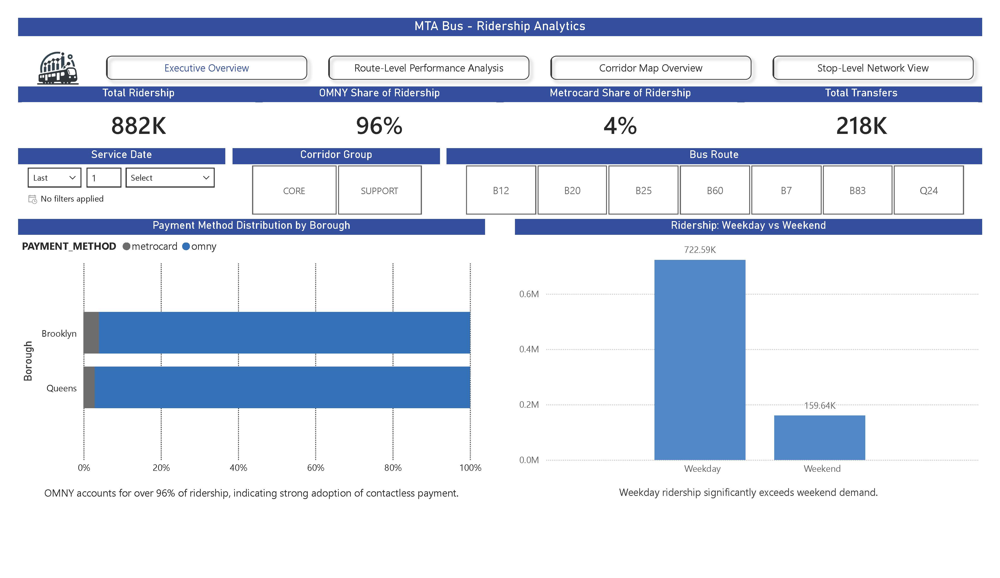
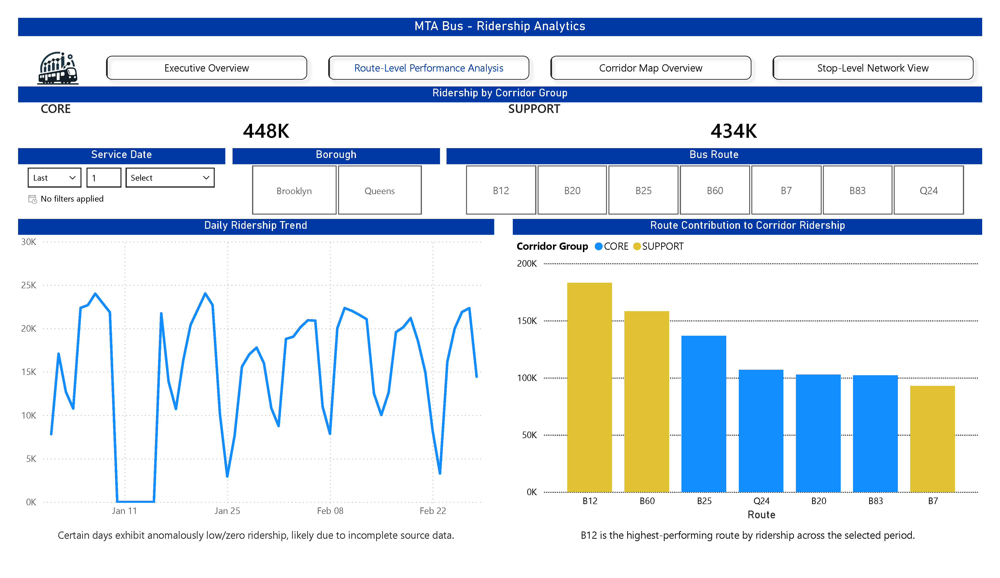
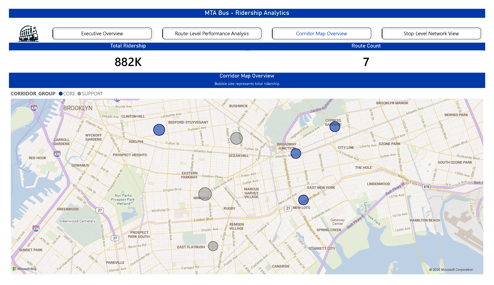
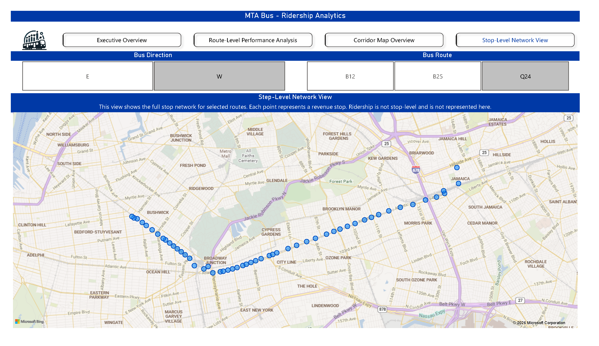

# MTA Bus Ridership Analytics Platform

**Snowflake + Power BI**

---

## Dashboard Preview
### Executive Overview


### Route Performance


### Corridor Map


### Stop-Level


## Overview

An end-to-end analytics platform for MTA bus ridership across a targeted Brooklyn-Queens corridor. The pipeline transforms raw transit data into structured, analytics-ready datasets in Snowflake and delivers interactive dashboards in Power BI.

**Scope:** 7 bus routes (B7, B12, B20, B25, B60, B83, Q24) | Jan-Feb 2026 | 237,888 fare transactions | 655 revenue stops

---

## Business Problem

Transit agencies generate large volumes of operational data, but deriving actionable insights requires structured data modeling and consistent transformation logic. Key questions include:

- When and where does peak demand occur?
- Which routes drive the most ridership within the corridor?
- How is OMNY adoption progressing relative to MetroCard?
- How does ridership shift week over week?

---

## Solution

Designed and implemented a layered data platform in Snowflake:

- Scoped and ingested route-level ridership data (Jan-Feb 2026)
- Integrated geospatial bus stop reference data (2,583 stop-route mappings)
- Standardized and modeled data using a **RAW > STG > MART** architecture
- Built analytics-ready fact tables, dimension tables, and report views
- Delivered interactive dashboards in Power BI

---

## Tech Stack

| Layer | Technology |
|-------|------------|
| Data Warehouse | Snowflake |
| Data Modeling | SQL |
| Visualization | Power BI |
| Notebook | Snowflake Notebooks (Python + SQL) |

---

## Data Architecture

```
MTA_BUS (Database)
|
|-- RAW (Landing Layer)
|   |-- BUS_HOURLY_RIDERSHIP_RAW    237,888 rows   Hourly fare transactions by route
|   |-- BUS_STOPS_RAW                 2,583 rows   GTFS stop-route reference data
|
|-- STG (Staging Layer)
|   |-- STG_BUS_HOURLY_RIDERSHIP    237,888 rows   Cleaned, typed, enriched ridership
|   |-- STG_BUS_STOPS                 2,583 rows   Normalized stop reference with borough heuristic
|
|-- MART (Analytics Layer)
|   |-- FCT_BUS_ROUTE_DAILY              413 rows   Daily route-level aggregations
|   |-- FCT_BUS_ROUTE_HOURLY          19,824 rows   Hourly route-level aggregations
|   |-- DIM_BUS_ROUTE_LOCATION              7 rows   Route centroids (avg lat/lon from revenue stops)
|   |
|   |-- RPT_BUS_CORRIDOR_DAILY_SUMMARY      Corridor-level daily rollup (Core vs Support)
|   |-- RPT_BUS_FARE_CLASS_DAILY             Fare class breakdown by route and day
|   |-- RPT_BUS_ROUTE_PEAK_HOURS             Average ridership by route and hour
|   |-- RPT_BUS_ROUTE_WOW_TREND              Week-over-week ridership change by route
|   |-- V_BUS_ROUTE_MAP                      Route centroids joined to daily ridership
|   |-- V_BUS_STOP_MAP                       Individual stop pins (655 revenue stops)
```

---

## Key Insights

- Ridership is heavily commuter-driven, with significantly higher weekday demand
- A small subset of routes drives the majority of corridor usage
- OMNY accounts for over 95% of transactions, indicating near-complete adoption
- Demand patterns vary by route, with distinct peak-hour behaviors
- Spatial analysis shows ridership concentrated along key corridor nodes

---

## Dashboard Features

**Executive Overview**
- Total ridership and KPI tracking
- Corridor segmentation (Core vs Support routes)
- Weekday vs weekend demand patterns

**Route Performance Analysis**
- Daily ridership trends
- Route ranking and contribution analysis
- Transfer behavior insights

**Time Analysis**
- Hourly demand curves
- Peak-hour identification
- Weekday vs weekend comparison

**Spatial Analysis**
- Route-level map (ridership-weighted centroids)
- Stop-level network visualization
- Directional route exploration

---

## Data Pipeline

```
CSV Files (MTA Open Data)
    |
    v
@BUS_RAW_STAGE (Snowflake Internal Stage)
    |
    v
RAW Layer -- COPY INTO with METADATA$FILENAME tracking
    |
    v
STG Layer -- Type casting, trimming, derived fields (date parts, corridor group, borough)
    |
    v
MART Layer -- Aggregated facts, dimension tables, report views, map-ready datasets
    |
    v
Power BI -- Connected to MART for dashboards and KPI cards
```

---

## Data Quality Notes

- **Jan 10-15, 2026:** Source data contains zero ridership across all routes for this 6-day period. This is a reporting gap from the MTA source system, not a pipeline error. These dates are flagged and should be filtered in downstream analysis to avoid skewing averages and trends.
- Stop-level data is used for spatial context only; ridership is modeled at the route level.

---

## Future Improvements

- Implement incremental data loading with change tracking
- Add anomaly detection for ridership spikes and gaps
- Automate pipeline scheduling with Snowflake Tasks
- Expand dataset coverage to additional boroughs and routes
- Add `IS_DATA_GAP` flag to staging/mart tables for automated gap handling

---

## Project Structure

```
MTA_Bus_Operations/
  MTA_Bus.ipynb        Snowflake Notebook - full pipeline (setup, load, transform, visualize)
  Kill_MTA_Bus.sql     Teardown script
  README.md            Project documentation
```

---

## Contact

**Daniel Souza**
Data Analyst | Power BI | Python | Snowflake


